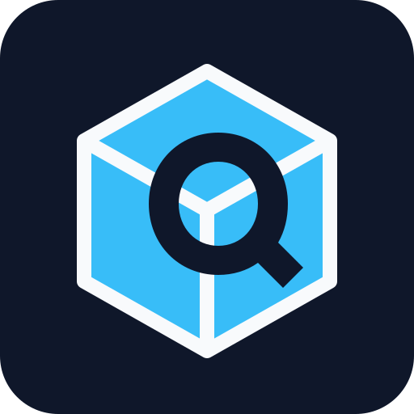

<div align="center">
  
  <h1>QShopWebUI</h1>
  <p>QuickShop-Hikari 商店网页管理系统</p>
  <p>
    <a href="https://github.com/ALingqing/QshopWebUI">
      
    </a>
    <a href="https://github.com/ALingqing/QshopWebUI/network/members">
      
    </a>
    <a href="https://github.com/ALingqing/QshopWebUI/issues">
      
    </a>
    
    
    <a href="https://github.com/ALingqing/QshopWebUI/actions/workflows/ci.yml">
      
    </a>
    <a href="https://github.com/ALingqing/QshopWebUI/releases">
      
    </a>
  </p>
  <p>
    <a href="http://202.189.10.108:20850/">在线演示</a>
    ·
    <a href="https://github.com/ALingqing/QshopWebUI">项目主页</a>
    ·
    <a href="https://github.com/ALingqing/QshopWebUI/issues">问题反馈</a>
  </p>
</div>

QuickShop-Hikari 商店网页管理系统，面向 Paper 服务端的单插件解决方案。插件直接读取游戏内商店数据，在不部署数据库和独立 Web 服务的情况下提供商店浏览、价格查询、网页购买、后台管理和数据导出能力。

## 这是什么

QShopWebUI 把 Web 管理界面、HTTP 服务和 QuickShop-Hikari 适配层整合到一个 Paper 插件中：

- 直接读取 QuickShop-Hikari 运行时数据，不依赖外部数据库。
- 通过反射兼容不同 QuickShop-Hikari 版本，降低服务端升级成本。
- 支持独立网页端口，也支持网页与 Minecraft 共用一个对外端口。
- 内置中文物品名称、拼音搜索、物品图标和错误图片资源。
- 支持商店实时刷新、历史数据导入、备份恢复和 CSV/JSON 导出。
- 管理操作直接作用于游戏内商店，适合小型服务器和面板部署。

## 能做什么

### 玩家端页面

- 首页公告与服务器信息展示
- 出售和收购商店浏览
- 物品中文名、英文注册名和拼音搜索
- 按物品、店主、世界、价格和商店类型筛选
- 商店详情、坐标、库存状态和价格区间查看
- 在线购买和离线购买队列（填写游戏 ID + 游戏密码即可下单）
- 限购支持：服务器安装 QuickShop「Limited」扩展时，网页购买与游戏内共用每人额度，弹窗显示剩余可买数量
- 数据统计、访问统计和商店数量概览

### 管理后台

- 管理员登录与会话超时控制
- 商店搜索、批量改价、批量修改类型和删除
- 公告和网站显示名称管理
- 数据导入、导出、备份与恢复
- 历史商店记录导入
- QuickShop 连接状态、网页监听状态和商店数量查看

管理页面的删除和改价会直接影响游戏内商店。正式操作前建议先执行备份，并确认当前服务器数据已同步。

## 运行要求

| 项目 | 要求 |
| --- | --- |
| 服务端 | Paper 或 Spigot 1.18 及以上 |
| Java | Java 17 及以上 |
| 前置插件 | QuickShop-Hikari |
| 可选插件 | Vault 经济插件（购买/收购）、AuthMe（下单密码验证）、QuickShop「Limited」扩展（限购） |
| 构建环境 | Maven 3.6 及以上 |

插件对 QuickShop-Hikari 使用反射调用，因此编译时不需要安装 QuickShop-Hikari JAR。QuickShop 缺失时插件仍可加载，但商店页面没有实际商店数据。

## 怎么安装

1. 从 Releases 页面下载最新的 `QShopWebUI-x.y.z.jar`，或按「自己构建」一节自行编译。
2. 将 JAR 放入服务端的 `plugins/` 目录。
3. 安装并启用 QuickShop-Hikari；如果需要网页购买或收购，再安装 Vault 和经济插件；服务器装了 AuthMe 时，下单会自动验证游戏密码。
4. 启动服务器，等待插件生成 `plugins/QShopWebUI/config.yml`。
5. 修改管理员账号、端口和运行模式。
6. 执行 `/qshopwebui reload`，或重启服务器。

## 端口怎么配

### 独立端口

适用于服务器可以额外开放一个网页端口的情况：

```yaml
port: 20850
mode: standalone
bind: 0.0.0.0
```

浏览器访问 `http://服务器IP:20850/`。该模式不会接管 Minecraft 游戏端口，配置最简单，优先推荐。

### 单端口复用

适用于面板只提供一个对外端口的情况。插件监听玩家使用的对外端口，并根据连接头自动区分 HTTP 和 Minecraft 流量；Minecraft 实际服务端需要改到容器内部的另一个端口。

```yaml
port: 12345
mode: multiplex
mc-host: 127.0.0.1
mc-port: 25565
```

配置步骤：

1. 将 `server.properties` 的 `server-port` 改为内部端口，例如 `25565`。
2. 确保 Minecraft 服务端只监听内部端口。
3. 将 QShopWebUI 的 `port` 设置为对外端口。
4. 将 `mode` 设置为 `multiplex`，然后完整重启服务器。
5. 玩家继续使用原来的对外地址连接游戏，浏览器使用相同地址访问网页。

如果使用 Pterodactyl 或其他容器面板，请同时检查启动命令是否把外部端口变量写入了 Minecraft 的 `server-port`。Minecraft 仍占用对外端口时，插件无法启动复用监听器。

### 自动模式

```yaml
mode: auto
```

当配置的 `port` 等于当前 Minecraft 游戏端口时自动选择 `multiplex`，否则选择 `standalone`。首次部署建议使用 `standalone`，确认网页和端口均正常后再切换复用模式。

## 配置文件

配置文件位置：`plugins/QShopWebUI/config.yml`。

```yaml
server-name: ""
server-subtitle: ""

port: 20130
bind: 0.0.0.0
mode: auto
mc-host: 127.0.0.1
mc-port: 0

admin:
  username: admin
  password: admin123

session-timeout: 3600

web:
  max-page-size: 500
  default-page-size: 60
  max-body-size: 10485760
  access-log: false
  snapshot-ttl-ms: 5000

purchase:
  enabled: true
  max-amount: 64
  allow-offline-buy: true

pages:
  hide-home: false
  hide-buy: false
  hide-sell: false
  hide-browse: false
  hide-shops: false
  hide-stats: false

debug: false
```

### 管理员密码

`admin.password` 支持明文和 SHA-256 两种形式：

```yaml
password: admin123
```

或：

```yaml
password: sha256:<64位十六进制摘要>
```

首次部署后应立即修改默认密码。网页后台修改密码后会自动保存为 `sha256:` 格式。

### 页面隐藏

`pages.hide-*` 只控制前台导航和页面可见性。管理员登录后仍可访问隐藏页面，网页后台的数据管理设置优先级高于配置文件默认值。

## 命令和权限

主命令：`/qshopwebui`，别名：`/qsw`、`/qshopweb`。

| 命令 | 说明 |
| --- | --- |
| `/qshopwebui` | 显示帮助 |
| `/qshopwebui status` | 查看监听端口、运行模式、QuickShop 状态和商店数量 |
| `/qshopwebui reload` | 重新读取配置并重启网页监听 |
| `/qshopwebui port <端口>` | 修改网页端口并尝试重新绑定 |

命令权限：`qshopwebui.admin`，默认仅 OP 拥有。输入 `/qshopwebui ` 后，插件会自动补全 `status`、`reload` 和 `port`；输入 `port` 后会提示当前端口。

## 演示站

演示地址：<http://202.189.10.108:20850/>

演示站展示了物品浏览、出售与收购价格、店主数量、世界数量和商店详情等前台功能。演示环境中的数据会随服务器运行状态变化，不应将其作为固定的价格或库存数据源。

管理后台不建议公开使用默认账号。部署到自己的服务器后，请修改管理员账号和密码，并通过面板防火墙限制管理端口的访问范围。

## 自定义网页与数据目录

插件数据目录为 `plugins/QShopWebUI/`。配置、公告、用户设置、访问统计和备份文件均位于该目录中，请勿直接提交到公开仓库。

如需自定义网页，可在数据目录下创建 `web/` 目录，放入从 JAR 解出的 `index.html`、`css/`、`js/` 和资源文件。磁盘上的文件优先于 JAR 内置资源，因此无需修改 Java 源码即可覆盖网页样式和脚本。

## 自己构建

在仓库根目录执行：

```bash
mvn clean package
```

产物：`target/QShopWebUI-1.0.1.jar`。

构建请带上 `clean`：否则可能把编辑器（VS Code / IDEA）增量编译到 `target/classes` 的旧产物直接打进 jar。

构建内容包括：

- `src/main/java/`：插件 Java 源码，根包为 `cn.aqcraft`。
- `src/main/resources/`：插件描述、默认配置和中文数据资源。
- `webroot/`：原生 HTML、CSS、JavaScript、Logo 和物品图片，打包到 JAR 的 `/web/` 目录。

可使用以下命令检查构建产物：

```bash
node tools/verify-jar.mjs
```

## 自动构建和发行

仓库自带 GitHub Actions，推送到 GitHub 后全自动运行，不需要在本地手动打包：

| 工作流 | 触发方式 | 做什么 |
| --- | --- | --- |
| CI | 推送 `main`、提交 PR、手动触发 | 构建插件、校验 JAR 内容、上传构建产物 |
| Release | 推送 `main`、推送 `v*` 标签、手动触发 | 发现新版本号时自动打标签、创建 Release、附加 JAR |

发行一个新版本的完整流程：

1. 修改 `pom.xml` 里的 `version`，例如从 `1.0.0` 改成 `1.1.0`。
2. 提交并推送到 `main`。
3. 工作流检测到 `v1.1.0` 还不存在，自动构建、创建标签、创建 Release 并上传 JAR。
4. 版本号没变时自动跳过，不会重复发行。

习惯手动打标签也可以：推送 `v1.1.0` 标签会直接触发发行，工作流也可以在 Actions 页面手动运行。

## 目录结构

```text
QshopWebUI/
├── .github/workflows/         GitHub Actions 自动构建与发行
│   ├── ci.yml
│   └── release.yml
├── pom.xml
├── README.md
├── src/main/java/cn/aqcraft/
│   ├── QShopWebUIPlugin.java
│   ├── api/          REST API 路由与处理器
│   ├── auth/         管理后台认证与会话
│   ├── bridge/       QuickShop、Vault、AuthMe 适配桥
│   ├── data/         商店快照、查询、统计和持久化
│   ├── history/      历史数据导入
│   ├── http/         HTTP 服务、嗅探和 Minecraft 转发
│   ├── listener/     Bukkit 与 QuickShop 事件监听
│   ├── purchase/     网页购买流程
│   └── util/         JSON、物品、材质和拼音工具
├── src/main/resources/
├── webroot/
│   ├── css/
│   ├── js/
│   ├── item/
│   ├── errormt/
│   └── logo.svg
├── tools/
└── target/           构建输出，不提交 Git
```

## 遇到问题？

### 网页打不开？

检查控制台是否出现端口占用、面板端口未放行或绑定地址错误。执行 `/qshopwebui status` 查看网页服务是否处于运行状态，并确认防火墙放行了配置中的 `port`。

### 页面没有商店数据？

确认 QuickShop-Hikari 已安装并启用，随后执行 `/qshopwebui status`。如果服务端插件版本较新或较旧，可查看控制台中的 QuickShop 适配状态。

### 复用模式启动失败？

确认 Minecraft 的 `server-port` 已改为内部端口，且 Minecraft 没有继续占用 QShopWebUI 的对外端口。修改端口后必须完整重启服务端，避免旧监听线程残留。

### 网页购买失败？

确认购买功能已启用，并安装可用的 Vault 经济后端。玩家在线时物品直接发放；玩家离线时需要开启 `purchase.allow-offline-buy`；服务器安装 AuthMe 时，下单还需输入该玩家的游戏密码。

### 提示超出限购？

商店设置了每人限购（QuickShop「Limited」扩展的 `limit`）。网页购买与游戏内共用同一额度：等待周期重置（每天/每周/每月由店主设置）或减少购买数量即可。

### 改了网页没生效？

浏览器执行强制刷新，并检查是否存在 `plugins/QShopWebUI/web/` 自定义网页覆盖目录。磁盘上的网页文件优先于 JAR 内置资源。

## 安全提醒

- 首次启动后立即修改默认管理员账号和密码。
- 管理端口不要直接暴露到公网，优先使用面板访问控制或反向代理鉴权。
- 执行批量删除、批量改价和恢复操作前先创建备份。
- 不要将 `plugins/QShopWebUI/` 下的用户数据、会话数据和备份文件提交到公开仓库。
- 在线演示仅用于功能展示，不应作为生产环境配置模板。

## 开发说明

- Java 源码和插件资源位于 `src/main/`，网页源码位于 `webroot/`。
- `tools/` 中的脚本用于资源生成和构建验证，不参与插件运行。
- 修改网页后重新执行 `mvn package` 即可更新 JAR 内的 Web 资源。
- 提交前建议运行 `mvn clean package`、`git diff --check` 和 `node tools/verify-jar.mjs`。

## 许可

本项目为个人开源项目，作者为阿清，项目地址为 <https://github.com/ALingqing/QshopWebUI>。

本插件与 QuickShop-Hikari 官方项目无隶属关系，未包含 QuickShop-Hikari 源码，仅通过公开接口和反射机制读取或操作商店数据。
